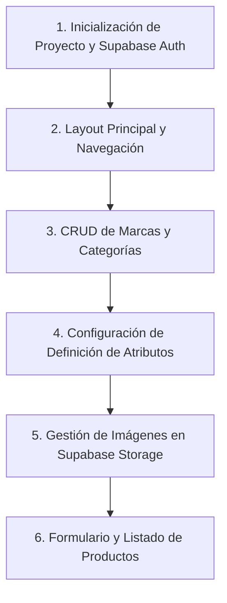

# KORA OS - Plan de Implementación de la Fase 1

Este documento detalla el plan técnico para la **Fase 1 (Catálogo Maestro)** de KORA OS. El objetivo es estructurar una base sólida utilizando tecnologías modernas de desarrollo web, de acuerdo con el stack tecnológico definido.

---

## 1. Arquitectura de Carpetas (Next.js 15 App Router)

Utilizaremos la estructura recomendada para Next.js 15 con TypeScript y Tailwind CSS, organizando las rutas mediante grupos de rutas (`(auth)` y `(dashboard)`) para aislar los layouts y middleware de protección de rutas de forma limpia:

```text
kora-os/
├── app/
│   ├── (auth)/
│   │   ├── layout.tsx             # Layout limpio sin navegación para autenticación
│   │   └── login/
│   │       └── page.tsx           # Formulario de login
│   ├── (dashboard)/
│   │   ├── layout.tsx             # Layout principal con Sidebar y Header (Protegido)
│   │   ├── page.tsx               # Dashboard (Widgets de estadísticas)
│   │   ├── brands/
│   │   │   └── page.tsx           # CRUD de Marcas (Lista/Modales)
│   │   ├── categories/
│   │   │   └── page.tsx           # CRUD de Categorías
│   │   └── products/
│   │       ├── page.tsx           # Listado de productos (Búsqueda y filtros)
│   │       ├── new/
│   │       │   └── page.tsx       # Creación de producto
│   │       └── [id]/
│   │           └── page.tsx       # Edición de producto
│   ├── api/
│   │   └── auth/
│   │       └── callback/
│   │           └── route.ts       # Endpoint para intercambio de código de autenticación
│   ├── globals.css                # Estilos globales y variables de Tailwind / Shadcn UI
│   ├── layout.tsx                 # Root layout (HTML, body, fuentes)
│   └── middleware.ts              # Middleware para protección de rutas con Supabase
├── components/
│   ├── ui/                        # Componentes genéricos de UI (Shadcn UI)
│   │   ├── button.tsx
│   │   ├── input.tsx
│   │   ├── dialog.tsx
│   │   └── ...
│   ├── dashboard/                 # Componentes específicos del dashboard
│   │   ├── sidebar.tsx
│   │   └── header.tsx
│   └── products/                  # Componentes y subformularios de productos
│       ├── product-form.tsx       # Formulario unificado para crear/editar
│       ├── image-uploader.tsx     # Carga y ordenamiento de imágenes
│       └── attribute-selector.tsx # Atributos dinámicos por categoría
├── hooks/
│   └── use-toast.ts               # Feedback visual
├── lib/
│   ├── utils.ts                   # Utilidades generales (clsx, twMerge)
│   └── supabase/
│       ├── client.ts              # Cliente Supabase para Client Components
│       ├── server.ts              # Cliente Supabase para Server Components / Actions
│       └── middleware.ts          # Lógica de refresh de sesión para Next.js Middleware
└── types/
    └── index.ts                   # Definición de tipos de TypeScript (database.types.ts)
```

---

## 2. Configuración de Supabase

Utilizaremos el paquete oficial `@supabase/ssr` para manejar de manera unificada las cookies y la sesión en Next.js App Router (RSC, Client Components, Server Actions y Middleware).

### Archivos clave en `lib/supabase/`:

*   **`client.ts`**:
    Para componentes del lado del cliente (`"use client"`).
    ```typescript
    import { createBrowserClient } from '@supabase/ssr'
    export const createClient = () => createBrowserClient(
      process.env.NEXT_PUBLIC_SUPABASE_URL!,
      process.env.NEXT_PUBLIC_SUPABASE_ANON_KEY!
    )
    ```

*   **`server.ts`**:
    Para componentes de servidor, Server Actions y API Routes.
    ```typescript
    import { createServerClient } from '@supabase/ssr'
    import { cookies } from 'next/headers'

    export const createClient = async () => {
      const cookieStore = await cookies()
      return createServerClient(
        process.env.NEXT_PUBLIC_SUPABASE_URL!,
        process.env.NEXT_PUBLIC_SUPABASE_ANON_KEY!,
        {
          cookies: {
            getAll() {
              return cookieStore.getAll()
            },
            setAll(cookiesToSet) {
              try {
                cookiesToSet.forEach(({ name, value, options }) =>
                  cookieStore.set(name, value, options)
                )
              } catch {
                // Manejar error si se llama desde un Server Component
              }
            },
          },
        }
      )
    }
    ```

*   **`middleware.ts`**:
    Actualiza la sesión activa del usuario para evitar que caduque durante el uso de la app.
    ```typescript
    import { createServerClient } from '@supabase/ssr'
    import { NextResponse, type NextRequest } from 'next/server'

    export async function updateSession(request: NextRequest) {
      let supabaseResponse = NextResponse.next({ request })

      const supabase = createServerClient(
        process.env.NEXT_PUBLIC_SUPABASE_URL!,
        process.env.NEXT_PUBLIC_SUPABASE_ANON_KEY!,
        {
          cookies: {
            getAll() {
              return request.cookies.getAll()
            },
            setAll(cookiesToSet) {
              cookiesToSet.forEach(({ name, value, options }) => request.cookies.set(name, value))
              supabaseResponse = NextResponse.next({ request })
              cookiesToSet.forEach(({ name, value, options }) =>
                supabaseResponse.cookies.set(name, value, options)
              )
            },
          },
        }
      )

      await supabase.auth.getUser()
      return supabaseResponse
    }
    ```

---

## 3. Sistema de Autenticación

El acceso a KORA OS estará completamente protegido mediante Supabase Auth.

*   **Middleware de Protección (`middleware.ts` en la raíz)**:
    1. Interceptará todas las rutas excepto `/login` y archivos estáticos.
    2. Ejecutará `const { data: { user } } = await supabase.auth.getUser()`.
    3. Si el usuario no está autenticado y accede a una ruta protegida (como `/` o `/products`), será redirigido a `/login`.
    4. Si está autenticado y accede a `/login`, será redirigido a `/`.

*   **Formulario de Login (`app/(auth)/login/page.tsx`)**:
    *   Campos: Correo electrónico y contraseña.
    *   Manejado mediante una **Server Action** (`loginAction`) para evitar exponer credenciales o endpoints en el cliente.
    *   Uso de `lucide-react` para iconos y transiciones de carga suaves (deshabilitar botones al enviar).

---

## 4. Estructura de Layouts

### A. Layout de Autenticación (`app/(auth)/layout.tsx`)
*   Diseño limpio sin navegación superior ni lateral.
*   Fondo oscuro con gradientes sutiles o efecto frosted glass en el contenedor central de login.
*   Centrado vertical y horizontal total.

### B. Layout de la Aplicación (`app/(dashboard)/layout.tsx`)
*   **Sidebar Fijo (Escritorio)** / **Sidebar Colapsable (Móvil)**:
    *   Panel lateral que contiene el logo de KORA OS, la navegación y el perfil de usuario en la base con botón de cerrar sesión.
*   **Header Superior**:
    *   Muestra el título de la página actual, un botón de notificaciones sutil y el menú desplegable de perfil de usuario.
*   **Contenedor Principal**:
    *   Área de scroll independiente con relleno (padding) adecuado para mostrar de manera limpia y responsiva las tablas y formularios del sistema.

---

## 5. Estructura de Navegación

El Sidebar contará con los siguientes elementos de navegación configurados en una lista JSON para escalabilidad:

| Item | Icono (Lucide) | Ruta | Descripción |
| :--- | :--- | :--- | :--- |
| **Dashboard** | `LayoutDashboard` | `/` | Vista general y widgets de control. |
| **Productos** | `Package` | `/products` | Catálogo Maestro (Crear, Editar, Eliminar). |
| **Categorías** | `FolderTree` | `/categories` | Jerarquías de categorías. |
| **Marcas** | `Bookmark` | `/brands` | Gestión de marcas del Grupo Kubbonet. |

*   **Micro-animaciones**: Efecto hover con deslizamiento del color de fondo y un indicador visual (línea vertical izquierda) en el enlace activo actual.

---

## 6. Implementación de Brands (Marcas)

*   **Ruta**: `/brands`
*   **Operaciones**: Crear, Leer, Editar y Desactivar (Soft Delete mediante la columna `active`).
*   **Interfaz**:
    *   Visualización de marcas en una tabla limpia (nombre, slug, estado activo/inactivo).
    *   Buscador rápido local en la tabla.
    *   **Modales de Creación y Edición**: Para agilizar el flujo de trabajo, la creación y edición se realiza a través de un diálogo emergente (`shadcn/ui/dialog`) sin salir de la vista actual.
*   **Lógica**:
    *   Generación automática del `slug` mediante código (por ejemplo, usando `slugify` sobre el nombre ingresado).
    *   Validación con **Zod** para evitar nombres vacíos o duplicados en el cliente.

---

## 7. Implementación de Categories (Categorías)

*   **Ruta**: `/categories`
*   **Operaciones**: CRUD completo.
*   **Jerarquía (Subcategorías)**:
    *   Uso de la columna `parent_id` (auto-referencia a la misma tabla `categories`).
*   **Interfaz**:
    *   Listado estructurado tipo árbol o tabla indentada para reflejar la relación padre-hijo (ej: Joyería > Pulseras).
    *   **Modal de Creación/Edición**: Selector opcional de "Categoría Padre" (filtrado para evitar que una categoría se seleccione a sí misma como padre).
*   **Lógica**:
    *   Generación de `slug` automática.
    *   Desactivación en cascada opcional o advertencia si se desactiva una categoría padre que contiene subcategorías activas.

---

## 8. Implementación de Products (Productos - Catálogo Maestro)

El módulo de productos es el corazón de la Fase 1. Debe administrar simultáneamente la información de múltiples tablas relacionales.

### A. Listado de Productos (`/products`)
*   **Buscador**: Búsqueda por SKU y Nombre.
*   **Filtros**: Selectores de Marca (`brand_id`), Categoría (`category_id`) y Estado (`active`).
*   **Tabla de Datos**: Columnas básicas (SKU, Nombre, Marca, Categoría, Costo, Precio, Stock, Estado).
*   **Paginación**: Paginación desde el servidor utilizando las capacidades de Supabase (`range`).

### B. Formulario de Creación/Edición (`/products/new` y `/products/[id]`)
El formulario estará dividido en secciones claras (utilizando pestañas o secciones colapsables):

1.  **Información General**:
    *   SKU (Código único).
    *   Nombre y Slug.
    *   Descripción Corta y Descripción Larga (Markdown/Texto enriquecido sutil).
2.  **Clasificación y Precios**:
    *   Selector de Marca (dropdown dinámico cargado de `brands`).
    *   Selector de Categoría (dropdown dinámico jerárquico).
    *   Costo, Precio de Venta y Stock inicial.
3.  **Logística (Tabla `product_dimensions`)**:
    *   Campos: Peso (`weight`), Largo (`length`), Ancho (`width`), Alto (`height`).
    *   *Nota*: Requerido por integraciones de envío de Mercado Libre, WooCommerce y Falabella.
4.  **Galería de Imágenes (Tabla `product_images`)**:
    *   Carga múltiple de archivos con subida al bucket de **Supabase Storage**.
    *   Ordenamiento de imágenes tipo arrastrar y soltar (drag and drop) para definir el `sort_order` (la primera imagen siempre será la principal).
5.  **Atributos Dinámicos (Tablas `attribute_definitions` y `product_attributes`)**:
    *   Al seleccionar una categoría, se consultan las definiciones de atributos disponibles.
    *   Se muestra un listado de campos dinámicos para que el usuario ingrese sus valores (ej. Piedra = "Turmalina", Diámetro = "8 mm" para joyería; Volumen = "500 ml" para detailing).

### C. Guardado Transaccional (Server Action)
El proceso de guardado debe ocurrir dentro de una transacción en Supabase o realizarse en un orden lógico estricto para evitar inconsistencias:
1.  Insertar/Actualizar en `products`.
2.  Insertar/Actualizar en `product_dimensions`.
3.  Subir imágenes a Supabase Storage y guardar URLs en `product_images`.
4.  Guardar los valores de atributos en `product_attributes` limpiando previamente los anteriores (en caso de edición).

---

## 9. Dependencias Necesarias

Para comenzar la implementación, se requieren los siguientes paquetes en su versión compatible con Next.js 15:

```json
{
  "dependencies": {
    "next": "^15.0.0",
    "react": "^19.0.0",
    "react-dom": "^19.0.0",
    "@supabase/supabase-js": "^2.43.0",
    "@supabase/ssr": "^0.4.0",
    "lucide-react": "^0.395.0",
    "zod": "^3.23.8",
    "react-hook-form": "^7.52.0",
    "@hookform/resolvers": "^3.6.0",
    "slugify": "^1.6.6",
    "clsx": "^2.1.1",
    "tailwind-merge": "^2.3.0",
    "class-variance-authority": "^0.7.0"
  },
  "devDependencies": {
    "typescript": "^5.0.0",
    "tailwindcss": "^3.4.0",
    "postcss": "^8.4.0",
    "autoprefixer": "^10.4.0"
  }
}
```

---

## 10. Orden Recomendado de Desarrollo

Se propone un desarrollo incremental estructurado en 6 pasos para asegurar que cada módulo sea probado individualmente antes de acoplarlo:



1.  **Paso 1: Esqueleto del Proyecto y Autenticación**:
    *   Instalar dependencias y estructurar la carpeta `app`.
    *   Configurar variables de entorno y los clientes de Supabase.
    *   Crear el `middleware.ts` y la ruta `/login`. Verificar la redirección de usuarios no autenticados.
2.  **Paso 2: Layout y Navegación**:
    *   Construir el Sidebar y Header del Layout principal.
    *   Asegurar el diseño responsivo (menú colapsable en móvil).
3.  **Paso 3: Módulos Auxiliares (Marcas y Categorías)**:
    *   Implementar base de datos y CRUDs de Marcas y Categorías con diálogos modales.
    *   Verificar la generación automática de slugs y relaciones jerárquicas en categorías.
4.  **Paso 4: Atributos y Logística**:
    *   Crear la lógica de lectura y asignación de atributos dinámicos (`attribute_definitions`).
    *   Configurar la validación del formulario de dimensiones.
5.  **Paso 5: Integración con Storage**:
    *   Configurar el Bucket en Supabase Storage.
    *   Crear el componente de carga de imágenes, validando formatos y tamaños.
6.  **Paso 6: Catálogo Maestro de Productos**:
    *   Ensamblar el formulario completo de productos (datos básicos, dimensiones, imágenes, atributos).
    *   Crear el listado principal de productos con filtros del lado del servidor.
    *   Probar la consistencia relacional en Supabase tras crear/editar productos.
